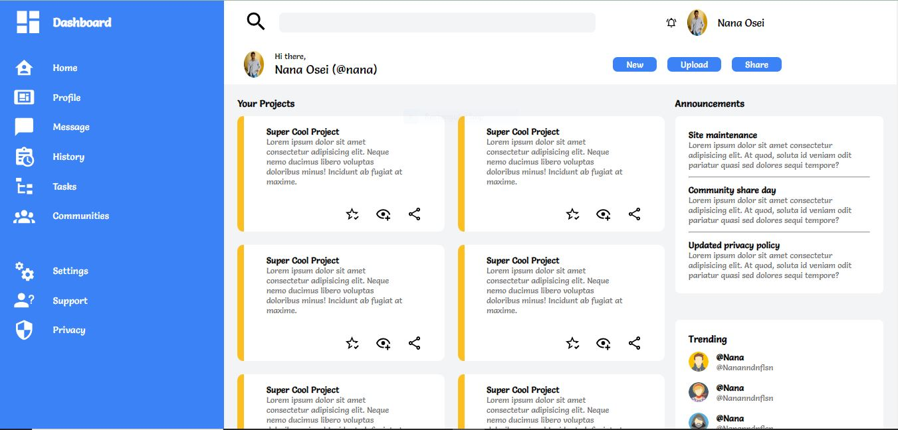

# Odin-Admin-Dashboard

## Table of contents

- [Overview](#overview)
  - [Screenshot](#screenshot)
  - [Links](#links)
- [My process](#my-process)
  - [Built with](#built-with)
  - [What I learned](#what-i-learned)
  - [Continued development](#continued-development)
- [Author](#author)
- [Acknowledgments](#acknowledgments)

### Screenshot




### Links

- Solution URL: [git@github.com:mayorr-star/Odin-Admin-Dashboard.git](https://git@github.com:mayorr-star/Odin-Admin-Dashboard.git.com)
<!-- - Live Site URL: [https://mayorr-star.github.io/Odin-Admin-Dashboard/](https://https://mayorr-star.github.io/Odin-Admin-Dashboard/.com) -->

Live Demo:
https://mayorr-star.github.io/Odin-Admin-Dashboard/

## My process

### Built with

- Semantic HTML5 markup
- CSS custom properties
- Flexbox
- CSS Grid

### What I learned

In this project, I used css grid for the positioning of the elements across the page. This has increased my understanding of css grid. I have also learnt how to create  resopnsive layout using css grid. I look forward to learning more and improving my css skills. Below are some snippets:
```css
.projects_content{
    display: grid;
    grid-template-columns: repeat(auto-fit, minmax(250px, 1fr));
    gap: 20px;
}

.project .action_block{
    margin-top: 30px;
    display: grid;
    grid-template-columns: repeat(3, 1fr);
    grid-row: 3;
    grid-column: 7 / 13;
}
```

### Continued development

There are some css grid properties I'm still not comfortable with(grid-area). I will focus on this area in my next project.

## Author

- Website - [Immanuel Osei Boateng](https://https://mayorr-star.github.io/Odin-Admin-Dashboard/.com)
- Twitter - [@His_mayorr](https://www.twitter.com/@His_mayorr)
